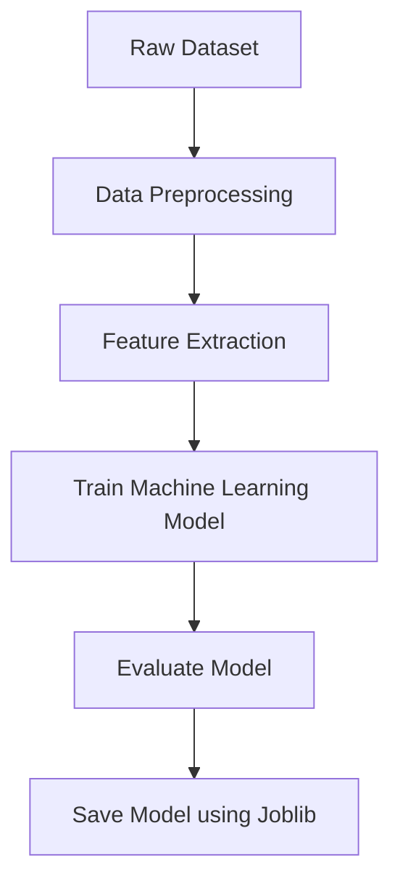
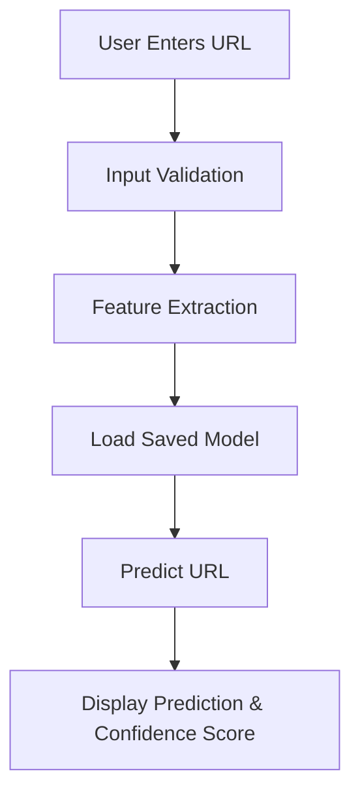

# 07. Project Architecture

## Purpose

This document describes the overall architecture of the **AI-Powered Phishing URL Detection System**. It explains the major components of the system, how they interact with one another, and how data flows during both model training and prediction.

The architecture serves as the technical blueprint for implementing, maintaining, and extending the application.

---

# Architectural Style

The project follows a **two-stage Machine Learning architecture** consisting of:

1. **Training Pipeline (Offline)**
2. **Inference Pipeline (Online Prediction)**

The Machine Learning model is trained only once using a dedicated training script. After training, the model is saved using **Joblib**. The Streamlit application loads this saved model whenever a user requests a prediction.

Separating training from prediction improves performance, simplifies maintenance, and reflects the architecture used in real-world Machine Learning applications.

---

# System Components

| Component | Description |
|-----------|-------------|
| **Dataset** | Stores the phishing URL dataset used for training the Machine Learning model. |
| **Data Preprocessing Module** | Cleans the dataset and prepares it for feature extraction and model training. |
| **Feature Extraction Module** | Extracts lexical (URL-based) features from URLs. This module is shared by both the Training and Inference pipelines to ensure consistency. |
| **Model Training Module** | Trains and evaluates the Machine Learning model using Scikit-learn. |
| **Saved Model** | Stores the trained Machine Learning model using Joblib for later use. |
| **Prediction Module** | Loads the trained model, extracts features from the user-provided URL, and generates predictions. |
| **Streamlit User Interface** | Allows users to enter URLs and view prediction results with confidence scores. |

---

# Training Pipeline (Offline)

The Training Pipeline is executed only by the developer.

It is used whenever:

- A new dataset is selected.
- Feature engineering changes.
- A different Machine Learning model is tested.
- The model needs retraining.



---

# Inference Pipeline (Runtime)

The Inference Pipeline executes every time a user submits a URL.



---

# Overall System Architecture

```mermaid
flowchart LR

Dataset --> Training

Training[Training Pipeline]

Training --> SavedModel[Saved Model (.joblib)]

User --> App[Streamlit Application]

App --> FeatureExtraction

FeatureExtraction --> SavedModel

SavedModel --> Prediction

Prediction --> Result[Prediction Result]
```

---

# Shared Feature Extraction Module

The **Feature Extraction Module** is shared between both the Training Pipeline and the Inference Pipeline.

During training, it converts dataset URLs into numerical features that the Machine Learning model can learn from.

During prediction, it converts the user's URL into the exact same feature format before sending it to the trained model.

Using a shared feature extraction module ensures that both pipelines generate identical feature representations, preventing inconsistencies between training and prediction. This improves reliability, maintainability, and prediction accuracy.

---

# Architectural Benefits

The chosen architecture provides several advantages:

- Separation of training and prediction logic.
- Faster application startup because the model is not retrained.
- Modular code that is easier to maintain and extend.
- Reusable feature extraction logic.
- Support for future enhancements such as Email Phishing Detection, Browser Extension integration, and Threat Intelligence APIs without major architectural changes.

---

# Architecture Summary

The AI-Powered Phishing URL Detection System follows a modular Machine Learning architecture in which data preprocessing, feature extraction, model training, model storage, prediction, and user interaction are clearly separated into independent components.

This design improves scalability, maintainability, and performance while following common software engineering and Machine Learning deployment practices.